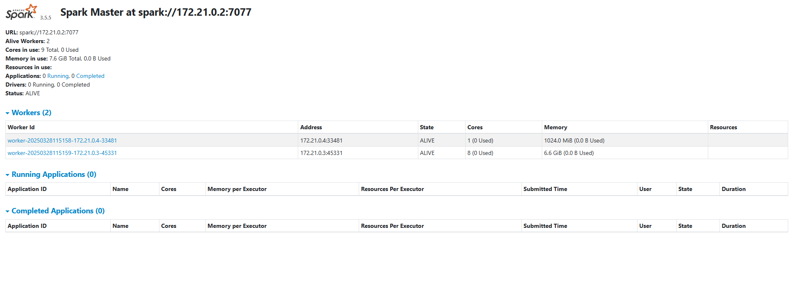

# dockerfile e entrypoints criados

# docker-compose criado 
 - no docker_compose, no serviço do worker, definimos a memória e os núcleos de processador que vão ser usados, mas ele depois vai ensinar a definir isso de uma outra maneira também.

## rodar docker-compose
`docker compose up -d`

## Testar se funcionou
Abrir o localhost:8080 e ver se está assim:

Os dois workers devem aparecer ali